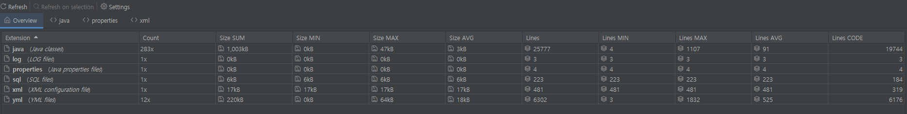
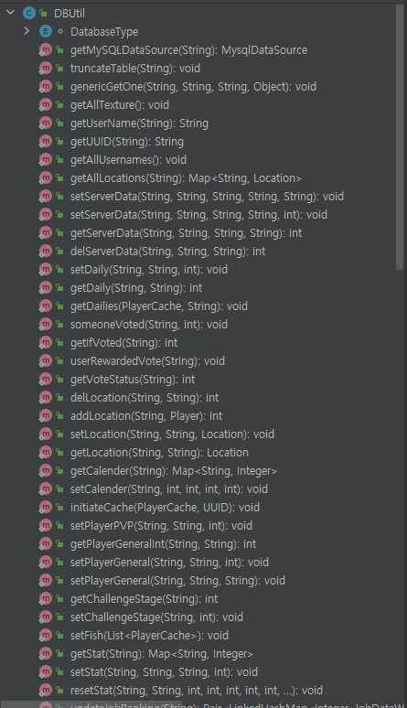

---
title: "2021-10-06 일지"
last_modified_at: 2021-10-06T15:10:02-05:00
categories:

  - diary
tags:
  - life
---

<h1>처음으로 해 보는 대규모 프로젝트, 그리고 실패(ft. 마인크래프트)</h1>


마인크래프트 서버 개발을 한답시고 서버의 다양한 기능을 몰아넣는 코어 플러그인을 개발했었다.


사실 학교 다니면서 부끄럽게도 코딩적 "외부" 활동을 거의 한 적이 없다. 왜인지는 잘 모르겠지만, 개발보다는 시사, 경제, 정치, 주식 등 좀더 당시 생각으로 **현실에 가까운** 것들에 관심을 더 가졌던 것 같다. 결과적으로 나쁘지는 않았지만 컴퓨터 공학을 전공하고도 코드를 못 짜는 바보 개발자가 되어버렸다.


사실 전업 투자자가 될 것이 아니라면 이래서는 안되겠다는 생각으로, 일단은 코딩을 좀 해 볼까 해서 시작한 것이 현재 마인크래프트 서버 코어로 돌아가고 있는 ***Lifecore*** 플러그인이다. 


먼저 아름다운 코드의 양을 보자




Java 가 2만줄이다. 사실 이것도 현재 플러그인을 "나누는" 과정이기에 5천줄이 빠진 상태다. 


이 플러그인이 하는 일은 다음과 같다.

```
상점 기능
채팅 조절 기능
튜토리얼 및 챌린지 기능
커스텀 레시피 기능
각종 GUI 만들기 
커스텀 아이템 만들기
배틀패스 기능 만들기
직업 시스템
스텟 시스템
거래 시스템
주민 거래 시스템
투표 시스템
랭크 시스템
커스텀 인첸트 시스템
```

이 많은 기능들을 플러그인 하나에 전부 몰아넣어 버렸으니 관리가 전혀 안 되는 것은 물론, 뭘 하나 바꾸려고 할때마다 나조차도 어디에 있는지를 까먹기 시작했다. 이 문제는 개발을 하고 한달 반정도가 지난 후부터 생겨, 코드가 2만줄에 육박할 때쯤에는 생산성이 바닥을 쳐버리고 마는 문제가 생겼다.


코드 줄 수가 긴 건 별 문제가 아니나 그냥 퀄리티가 너무 개판인 것이 가장 큰 문제다. 먼저 정말 가장 말도 안되는 곳인 데이터 처리쪽을 보자. 데이터는 대부분 MySQL 을 사용하여 처리하고 있다. 다음은 DBUtil.java 클래스의 메소드 목록이다. 





그리고 각 메소드는 이렇게 생겼다.


```java
    public static int delServerData(String table, String PKType, String PK) {
        try (Connection con = dsServer.getConnection();
             PreparedStatement ps = con.prepareStatement(SERVER_DEL_ONE.replace("{PKType}",PKType).replace("{table}",table));
        ) {
            ps.setString(1,PK);
            ps.execute();
        } catch (SQLException e) {
            e.printStackTrace();
        }
        return 0;
    }


    public static void setDaily(String uuid, String type, int value) {
        try (Connection con = dsServer.getConnection();
             PreparedStatement ps = con.prepareStatement(SERVER_SET_DAILY.replace("{type}",type));
        ) {
            ps.setString(1, uuid);
            ps.setInt(2, value);
            ps.executeUpdate();
        } catch (SQLException e) {
            e.printStackTrace();
        }
    }
```


그냥 전체 메소드가 다 이런 식이다. 대체 무슨 생각으로 이렇게 했는지 모르겠다... 사실 안다. 처음에 한 다섯개 할때는 큰 문제가 없었다. 다만 프로젝트가 계속해서 커지고 커지면서 데이터가 한 두개가 아니게 되고, 결국 이런 말도 안되는 괴물이 되어버렸다. 기본적인 코딩 practice 은 [DRY PRINCIPLE](https://en.wikipedia.org/wiki/Don%27t_repeat_yourself#:~:text=The%20DRY%20principle%20is%20stated,authoritative%20representation%20within%20a%20system%22.&text=When%20the%20DRY%20principle%20is,in%20other%20logically%20unrelated%20elements.) 을 못 지키는건 조사하고 이정도면 홍수가 날 지경이다.


그냥 주먹구구식으로 개발을 하다가 이러한 문제를 맞이하여 디자인 패턴에 관심이 생기기 시작했다. 그래서 [refactoring guru](https://refactoring.guru/) 라는 사이트에서 Java 관련 디자인 패턴을 모두 읽어보기 시작했다.  하지만 이걸 읽는것 만으로는 조금 부족하여 패스트 캠퍼스에서 [자바 디자인 패턴](https://fastcampus.co.kr/dev_online_pej) 강의를 할인하기에 한번 구입해 봤다. 8월달에 구입을 했는데 당시 아직 강의가 올라오기 전이라 기다리다가 9월에도 안 올라와서.. 아직까지 보지는 않았다. 방금 확인해 보니 강의가 올라와 있는 것을 확인했다. 빨리 보고 익혀야겠다. 


마인크래프트로 업을 할 것은 아니지만, 이 코어 플러그인을 작성하면서 무엇을 공부해야 하는지에 대한 방향이 잡히게 된 것은 좋은 것 같다. 앞으로 이 마인크래프트 프로젝트는 위에 열거한 컨텐츠에 따라 플러그인을 나누면서 더 좋은 방향으로 리팩토링하는 과정이 필요할 듯 하다. 또한 나누는 과정에서 spigot 이나 한국 커뮤니티에 코드를 공개해 비판과 도움을 받아볼까 한다. 
